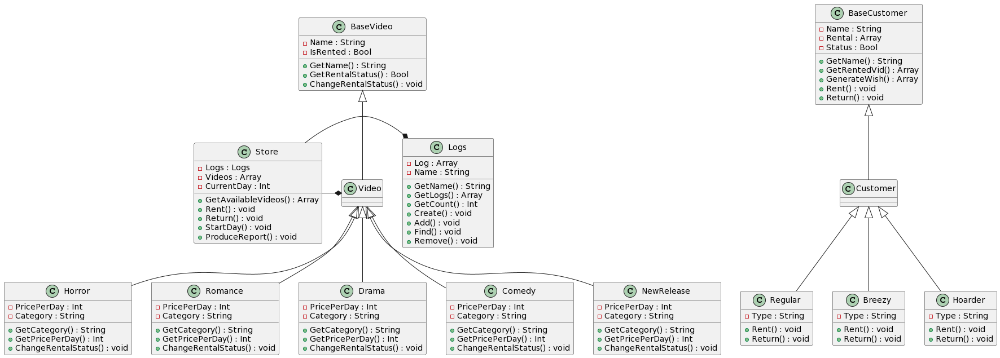

# **Object-Oriented Analysis and Design  -  HW3**

[Here](https://github.com/Maxxxxxx-x/OO_HW3) is the finished code for the 3rd assignment for the CSC0005 course.

<br/>

## **Components**
- [Design](#Design)
- [Usage](#Usage)


## <a name="Design"></a>**Design**
The [main script](./src/main.js) starts the simulation and initializes all necessary classes, including Videos, Customer and Store.

<br/>

There are a total of 4 classes which can be found in [this folder](./src/Classes/)

- [Logs](./src/Classes/Customer.js) - A class responsible for logging data in the rental store
- [Customer](./src/Classes/Customer.js) - The class for the Customers
- [Store](./src/Classes/Store.js) - The class for the video rental store
- [Video](./src/Classes/Video.js) - The class for the videos


Both ``Customer`` and ``Video`` uses a class factory method to create classes for each one of their types / categories. Both have similar designs where they both consists of a ***base class*** and a ***class factory***.

We also have 2 [utility scripts](./src/Util) which provides us with the ``Random()`` and ``randomUUID`` function. (UUID is a buildint function from `node:crypto`)


The UML class diagram can be found [here](./images/UML.png)

<br/>

All configurations can be edited within the [config script](./src/config.js) 

<br/>

## <a name="Usage"></a>**Usage**

### Prerequisites
- [Node.js](https://nodejs.org/en/) (LTS version is recommended)

### Setup
1. Use `command prompt` or `powershell` on Windows | `Termianl` Linux

2. Clone this github repository
```bash
git clone https://github.com/Maxxxxxx-x/OO_HW3
```

3. Change directory into the cloned folder
```bash
cd OO_HW3
```

4. Check if node is installed on your machine
```bash
node -v
```
if there is no output with the NodeJS version, please install it / add it to the PATH

5. Install the necessary dependencies with
```bash
npm i
```

6. Run the script with command
```bash
npm run start
```
